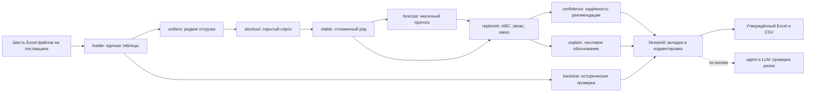

# EKT StockPilot — автопилот закупа

Локальный веб-сервис, который превращает выгрузки 1С в проверяемый заказ поставщикам с объяснением по каждому товару.

## Проблема и пользователь

Менеджер закупа ТОО «Электрокомплект» вручную сводит продажи, остатки, товар в пути и кратности отгрузки в Excel. Разовые крупные продажи могут завысить потребность, а отсутствие товара на складе — скрыть реальный спрос. В результате возникают излишки и дефицит. StockPilot собирает эти данные, предлагает количество к заказу и показывает, из каких чисел оно получилось. Окончательное решение остаётся за менеджером.

## Результат в цифрах

Расчёт на демо-выгрузках на **22.09.2026**:

| Поставщик | Позиций к заказу | Критичных | Исключено разового объёма за январь 2025 — август 2026 | Медиана покрытия после заказа | Позиций с покрытием >6 мес. |
| --- | ---: | ---: | ---: | ---: | ---: |
| IEK | 402 | 150 | 2,6% | 2,74 мес. | 10 |
| Systeme Electric | 143 | 22 | 3,1% | 2,87 мес. | 8 |

Оставшиеся позиции с покрытием более шести месяцев связаны с кратностью MOQ: заказ меньше одной упаковки оформить нельзя. Для сравнения, до ограничения страхового запаса таких позиций было **73** у IEK и **27** у Systeme Electric.

Бэктест: три исторических расчёта на **01.04, 01.05 и 01.06.2026**, прогноз на три следующих месяца. WAPE — сумма абсолютных ошибок, делённая на сумму фактических продаж; меньше — лучше. В каждой строке методы сравниваются на **одних и тех же активных артикулах**.

| Поставщик и группа | StockPilot | Среднее за 12 мес. | Среднее за 3 мес. |
| --- | ---: | ---: | ---: |
| IEK, все активные | **44,3%** | **42,3%** | 45,3% |
| IEK, товары с исключённым всплеском или восстановленным дефицитом | **40,8%** | 44,8% | 47,6% |
| Systeme Electric, все активные | **26,9%** | 28,4% | 32,9% |
| Systeme Electric, товары с корректировкой спроса | **46,7%** | 47,3% | **45,8%** |

На всех активных IEK среднее за 12 месяцев точнее StockPilot на 2,0 процентных пункта; на корректируемых товарах StockPilot точнее его на 4,0 пункта. У Systeme Electric в группе с корректировкой среднее за 3 месяца лучше StockPilot на 0,9 пункта. Положительное смещение означает завышение: у StockPilot по всем активным IEK оно **−2,7%**, у Systeme Electric **−3,1%**. Полная разбивка по датам и методам появляется на вкладке «Точность прогноза» и в `output/backtest_metrics.csv`.

## Что реализовано

- Чтение шести видов `.xlsx` для IEK и Systeme Electric; демо-выгрузки уже лежат в репозитории.
- Выявление редких крупных отгрузок, осторожное восстановление спроса в месяцы дефицита, устойчивый месячный ряд, прогноз с ростом и сезонностью.
- ABC, ограниченный страховой запас, срок поставки, товар в пути, MOQ, срочность, уровень уверенности и понятное обоснование каждого заказа.
- Карточка артикула с графиком; сравнение с заполненными полями таблицы закупщика Systeme Electric.
- Фильтры, редактирование количества, утверждение и скачивание одного Excel с отдельными листами поставщиков; дополнительные CSV.
- Загрузка новых выгрузок через интерфейс с проверкой структуры и возврат к демо-данным.
- Бэктест против средних за 12 и 3 месяца; результаты в CSV и график по артикулу.
- Необязательные ИИ-объяснения, чат и агент проверки заказа с тремя инструментами. Все числовые расчёты выполняет Python; без API-ключа сервис показывает детерминированный отчёт.

## Как пользоваться

1. В боковой панели выберите поставщика и, если нужно, измените период пересмотра, коэффициенты сервиса или дату. Нажмите **«Рассчитать»**. При первом открытии расчёт выполнится автоматически.
2. На вкладке **«Заказ»** просмотрите критичные позиции, уверенность и таблицу. Фильтры меняют только вид таблицы. По умолчанию показаны товары с заказом больше нуля; **«Показать все позиции»** откроет и нулевые заказы.
3. На вкладке **«Карточка артикула»** откройте любой код, включая товар с нулевым заказом. Посмотрите факт, очищенный спрос, дефицит, всплески, прогноз и полный текст объяснения.
4. При необходимости исправьте **«Корректировку»** в таблице. Нажмите **«Проверить заказ ИИ-агентом»**, прочитайте список рисков, затем **«Утвердить заказ»** и **«Скачать заказ (Excel)»**. Файл также появится в `output/`. Поставщику он автоматически не отправляется.
5. На вкладке **«Точность прогноза»** нажмите **«Рассчитать бэктест»** и сравните StockPilot с двумя простыми средними. Расчёт запускается только по кнопке и кэшируется.

## Технологии

| Инструмент | Для чего |
| --- | --- |
| Python | Чтение данных, расчёт и экспорт |
| pandas и numpy | Таблицы, очистка, прогноз и формулы |
| openpyxl | Чтение Excel, кэшированных значений формул MOQ и создание заказа |
| Streamlit | Локальный веб-интерфейс, кэширование тяжёлой части |
| Plotly | Графики спроса и прогноза |
| openai и python-dotenv | Необязательный ИИ и чтение ключей из `.env` |
| pytest | Автоматические проверки расчёта, загрузки и Excel |

Для объяснений используется **OpenAI `gpt-4.1-mini`**; при отсутствии ключа OpenAI или ошибке — **NVIDIA `meta/llama-3.1-8b-instruct`** через совместимый API, если есть ключ NVIDIA. Если ключей нет, используется детерминированный текст. **OpenAI Codex** применялся как ИИ-агент разработки проекта; он не участвует в расчёте заказа при работе сервиса.

## ИИ в проекте

- **Объяснение артикула:** по кнопке ИИ получает только агрегаты одной позиции и пишет 1–2 предложения; без ключа выводится тот же проверяемый числовой текст из `src/explain.py`.
- **Ассистент:** отвечает на вопрос по компактной сводке текущей таблицы и топу позиций; без ключа даёт короткую шаблонную сводку.
- **Агент перед утверждением:** по кнопке анализирует исправленные менеджером количества. Код сначала рассчитывает флаги риска: покрытие >6 месяцев, заказ >3 средних месячных продаж, рост на границе, низкую уверенность, крупный исключённый всплеск и расхождение с заполненными полями Systeme Electric. При наличии ключа модель через [function calling](https://developers.openai.com/api/docs/guides/function-calling) сама выбирает инструменты `list_flags`, `get_item_details` и `get_supplier_summary`; максимум 6 вызовов инструментов и 40 секунд. Интерфейс показывает список вызовов. Без ключа или при ошибке **жюри увидит отчёт той же структуры** из детерминированных проверок: 3–7 конкретных пунктов с кодами и причинами, если столько рисков найдено.

Для включения ИИ скопируйте `.env.example` в `.env` и впишите `OPENAI_API_KEY` или `NVIDIA_API_KEY` по инструкции ниже. В LLM не уходят номера накладных, идентификаторы клиентов, строки транзакций или сами Excel-файлы: только агрегаты и краткая сводка. Количества заказов ИИ не рассчитывает и не меняет.

## Архитектура



`loader → outliers → stockout → stable → forecast` — тяжёлая часть. Её результат кэшируется по поставщику, источнику, времени изменения файлов и дате расчёта. Изменение периода пересмотра или коэффициента сервиса после кнопки **«Рассчитать»** запускает только лёгкую часть `replenish` и определение уверенности. Время обеих частей выводится в консоль. Бэктест считает исторические даты отдельно и кэшируется после своей кнопки.

```text
app.py                  интерфейс и настройки
src/loader.py           чтение и нормализация Excel; дата по накладным
src/outliers.py         очистка редких отгрузок
src/stockout.py         восстановление спроса при дефиците
src/stable.py           устойчивый месячный ряд
src/forecast.py         сезонность, рост и прогноз
src/replenish.py        ABC, запас, MOQ, заказ и срочность
src/confidence.py       уверенность по позиции
src/backtest.py         исторический прогноз и метрики
src/agent.py            инструменты и агент проверки заказа
src/explain.py          детерминированные объяснения
src/llm.py              необязательный ИИ с резервным провайдером
src/pipeline.py         тяжёлая и лёгкая части расчёта
src/ui.py               вкладки и карточка артикула
src/export.py           Excel и сводка
src/uploads.py          проверка и сохранение новых выгрузок
src/config.py           параметры по умолчанию
data/raw/               демо-выгрузки IEK и SystemeElectric, по 6 файлов
data/cache/             локальный pickle-кэш; создаётся автоматически
data/uploads/           загруженные пользователем файлы; создаётся автоматически
output/                 утверждённые файлы заказа; создаётся автоматически
scripts/backtest.py     CSV бэктеста и таблица метрик в консоли
scripts/                разведка данных, полный прогон и диагностика
tests/                  автоматические тесты
.streamlit/config.toml  минимальная панель Streamlit
```

## Требования

- **Python 3.10, 3.11 или 3.12** с [python.org](https://www.python.org/downloads/). Проект проверен на Python 3.10 (Windows) и 3.12 (Linux). На Windows при установке отметьте **«Add python.exe to PATH»**.
- **Git** с [git-scm.com](https://git-scm.com/downloads).
- Проверьте версии в терминале: `python --version` и `git --version`. На Windows, если команда `python` не найдена, попробуйте `py --version` и советы ниже.

Для клонирования с GitHub и установки пакетов нужен интернет. После установки локальный расчёт работает без сети; доступ к ИИ через API — дополнительная возможность.

## Установка и запуск

### Windows — PowerShell

Откройте PowerShell. Выполните команды по порядку:

```powershell
python --version
git --version
git clone https://github.com/BAITC-Hacks/hack-1c4513ed-aday.git
cd hack-1c4513ed-aday
python -m venv .venv
.\.venv\Scripts\Activate.ps1
python -m pip install --upgrade pip
python -m pip install -r requirements.txt
python -m pytest -v
python -m streamlit run app.py
```

После активации виртуального окружения в начале приглашения терминала должно быть `(.venv)`. Если PowerShell пишет **«выполнение сценариев отключено»**, выполните в этом же окне:

```powershell
Set-ExecutionPolicy -Scope Process -ExecutionPolicy Bypass
.\.venv\Scripts\Activate.ps1
```

Альтернатива без PowerShell: откройте `cmd` в папке проекта, выполните `.venv\Scripts\activate.bat`, затем команды установки и запуска, начинающиеся с `python -m ...`.

### macOS / Linux — Terminal

```bash
python3 --version
git --version
git clone https://github.com/BAITC-Hacks/hack-1c4513ed-aday.git
cd hack-1c4513ed-aday
python3 -m venv .venv
source .venv/bin/activate
python -m pip install --upgrade pip
python -m pip install -r requirements.txt
python -m pytest -v
python -m streamlit run app.py
```

Ключ ИИ **необязателен**. Чтобы включить его, до запуска приложения скопируйте шаблон настроек и заполните `OPENAI_API_KEY` или `NVIDIA_API_KEY` в новом файле `.env`:

```powershell
copy .env.example .env
```

На macOS/Linux используйте `cp .env.example .env`. Ключ OpenAI создаётся в [OpenAI API keys](https://platform.openai.com/api-keys), ключ NVIDIA — на [NVIDIA Build](https://build.nvidia.com/). Не добавляйте `.env` в Git. Без ключа кнопка ИИ покажет расчётное шаблонное объяснение.

При первом запуске Streamlit может спросить email — просто нажмите **Enter**. Откройте [http://localhost:8501](http://localhost:8501). Для остановки вернитесь в терминал и нажмите **Ctrl+C**. Все демо-данные уже в `data/raw/`: скачивать отдельные файлы не нужно.

## Проверка решения за 7–10 минут

| Шаг | Действие жюри | Ожидаемый результат |
| --- | --- | --- |
| 1 | Запустите приложение. В боковой панели выберите **IEK**, нажмите **«Рассчитать»**. | В шапке дата **22.09.2026**; на вкладке «Заказ» — KPI, топ-5 критичных и таблица с положительным заказом. |
| 2 | На вкладке «Карточка артикула» выберите **`010500008_`**, «ВА47-29 (1ф) 25А IEK». | Отдельная отметка и фраза о разовой отгрузке **7 488 шт.** в текущем месяце. Прогноз около **20 707 ед./мес.**, заказ **0** из-за остатка **39 733**, покрытие около **2,5 мес.** |
| 3 | Откройте **`280300396_`**, распределительную коробку КМ41001. | На графике отмечены дефицитные месяцы; восстановлено около **414 ед.** за историю. Прогноз **353 ед./мес.**, заказ **206**, покрытие **2,0 мес.** при фактическом среднем **294 ед./мес.** за последние шесть месяцев. |
| 4 | Откройте **`280300181_`**, коробку КМ41241. | Сентябрьские очищенные продажи **59** в 2024 и **72** в 2025 году против медианы остальных месяцев **17**. Сезонный индекс **1,63**, прогноз **41 ед./мес.**, заказ **48**, покрытие **1,9 мес.** |
| 5 | Откройте **`010500031_`**, выключатель ВН-32. | За шесть полных месяцев продаж **0**, прогноз и заказ **0**. Покрытие в месяцах не вычисляется при нулевом прогнозе. |
| 6 | На вкладке **«Точность прогноза»** нажмите **«Рассчитать бэктест»**. | Таблица покажет WAPE StockPilot и двух средних по обоим поставщикам; на графике можно выбрать код и дату исторического расчёта. Создадутся два CSV в `output/`. Для отдельной проверки из терминала: `python scripts/backtest.py`. |
| 7 | В боковой панели снимите галочку **«Дата автоматически по накладным»**, выберите **01.04.2026** и нажмите **«Рассчитать»**. | Поле даты станет доступным; в шапке появится ручная дата. Расчёт не использует продажи, остатки и накладные после неё. Затем верните автоматическую дату и нажмите «Рассчитать». |
| 8 | Измените «Уровень сервиса A, z» в форме, затем нажмите **«Рассчитать»**. | До нажатия расчёт не меняется. После нажатия изменятся запас или заказы части A-позиций; тяжёлая часть берётся из кэша. |
| 9 | На вкладке «Заказ» нажмите **«Проверить заказ ИИ-агентом»** без API-ключа. Откройте список инструментов. | Появится детерминированный отчёт с кодами и причинами, вызовы `list_flags` и `get_supplier_summary`. После проверки измените «Корректировку», утвердите и скачайте Excel: в листе поставщика есть «Уверенность». |
| 10 | Выберите **Systeme Electric**, откройте «Сравнение с таблицей закупщика». Затем в боковой панели загрузите все шесть файлов IEK из `data/raw/IEK/` и нажмите «Проверить и использовать». | Сравниваются заполненные средние продажи, запас и категория; пустой заказ менеджера не показан как ноль. Загрузка проверяет структуру, «Вернуться к демо-данным» снова включает `data/raw/`. |

Карточка артикула показывает также позиции с нулевым заказом, даже когда в таблице «Заказ» включён фильтр положительных заказов.

Пять обязательных проверок кейса выполняются на маленьких синтетических данных:

| Требование кейса | Тест | Что проверяет |
| --- | --- | --- |
| Все источники влияют на заказ | `test_all_sources_affect_order` | Остаток, путь, рост, ABC и история меняют количество; больше товара в пути уменьшает заказ. |
| Учитывается сезонность | `test_seasonality` | Пиковый месяц выше низкого и отличается от простого среднего. |
| Компенсируется дефицит | `test_stockout_compensation` | Восстановленный спрос увеличивает потребность. |
| Исключается разовый крупный заказ | `test_one_off_excluded` | Одна огромная накладная не меняет регулярную рекомендацию более чем на 10%. |
| Вывод обоснован по поставщикам | `test_output_explained_by_supplier` | В каждой строке есть поставщик и непустое объяснение. |

Команда проверки: `python -m pytest -v`. Ожидаемый итог для этой версии: **24 passed**. Дополнительные тесты проверяют устойчивость спроса, отсутствие утечки будущих данных в ручной дате и бэктесте, ограничение страхового запаса, уровень уверенности, вызовы инструментов агентом и fallback без ключа, импорт и структуру Excel.

## Методология расчёта

1. **Дата и история.** При открытии источника дата расчёта — дата последней расходной накладной этого поставщика; у демо обоих поставщиков это 22.09.2026. Для ручной даты нужно снять галочку в боковой панели. Продажи, остатки и накладные после выбранной даты отсекаются; продажи текущего неполного месяца пересобираются из накладных до этой даты. Для прошлой даты текущая таблица «в пути» и «Свободный остаток» не используются, потому что их исторического снимка нет. Неполный месяц не входит в базу истории, но его разовые отгрузки отмечаются отдельно; начальный остаток месяца не корректируется.
2. **Разовые отгрузки.** Для положительных строк накладных с января 2025 порог по артикулу: `max(медиана + 5 × 1,4826 × MAD; 10 × медиана; 10 единиц)`. Нужно минимум четыре строки. Отгрузка считается регулярной, если сопоставимый объём (не менее половины кандидата) встречался минимум в трёх разных месяцах 12-месячного окна, содержащего её месяц. Редкую строку исключаем целиком. Оба периода сравнения роста очищаются одинаково. Для 2024 года без надёжных строк накладных действует односторонний месячный Hampel-фильтр; обычный месячный спрос дополнительно не срезается.
3. **Дефицит.** Месяц с начальным остатком `≤ 0` считается дефицитным, если следующий остаток тоже `≤ 0` **или** очищенные продажи ниже половины типичного сезонного уровня. Типичный уровень — медиана очищенных продаж **только за последние 12 полных месяцев с положительным остатком** после поправки на сезонность. Если таких месяцев меньше трёх, спрос не восстанавливается. Восстановленный спрос — максимум факта и типичного уровня с сезонностью, но **не выше максимума очищенных продаж за те же 12 месяцев**.
4. **Устойчивый ряд.** Перед прогнозом и вычислением σ месяцы последних 24 полных месяцев сглаживаются: положительное значение выше `медиана положительных месяцев + 3 × 1,4826 × MAD` заменяется порогом. Нужно минимум четыре положительных месяца. Повторяющийся высокий уровень в ≥3 разных месяцах и сопоставимый пик в том же календарном месяце двух лет сохраняются как регулярный спрос. Исходный факт не меняется: график показывает его отдельной линией.
5. **Прогноз и сезонность.** База — взвешенное среднее устойчивого десезонализированного спроса за последние шесть полных месяцев; свежие месяцы имеют больший вес. Рост — отношение этих шести месяцев к тем же месяцам год назад, ограниченное интервалом **0,70–1,50**; при нехватке истории — **1**. Сезонность артикула используется при ≥18 месяцах истории, ≥12 месяцах с продажами и сумме ≥60 единиц. Индекс артикула смешивается пополам с индексом бренда, затем ограничивается **0,5–2,0**. При короткой истории используется бренд. Сезонность бренда берётся из доступных на дату расчёта денежных продаж прошлых лет. Прогноз месяца = `база × рост × сезонный индекс`.
6. **ABC и запас.** Категория зависит от очищенного и восстановленного объёма за 12 полных месяцев: A — первые 80% накопленного объёма, B — до 95%, C — остальное. Уровни сервиса: A — 95% (`z=1,65`), B — 90% (`z=1,28`), C — 85% (`z=1,04`). Исходный страховой запас = `z × σ × √((L+R)/30)`, где σ — стандартное отклонение устойчивого месячного спроса, L — срок поставки, R — период пересмотра (по умолчанию 30 дней). Окончательный запас **не больше минимума прогноза за один месяц и спроса за L+R**. Для прерывистого спроса тот же горизонт служит дополнительным ограничением.
6. **Заказ.** Потребность = сумма помесячного прогноза пропорционально дням интервала `L+R` + страховой запас. Вычитаются остаток и товар в пути; положительный результат округляется вверх до MOQ. Если за последние шесть полных месяцев продаж не было **или** прогноз `< 0,5 ед./мес.`, заказ принудительно **0** с фразой «нет устойчивого спроса». Для IEK L — медиана дней между датами документов и ожидаемого прихода (**18 дней** в демо); для Systeme Electric — **30 дней**.
7. **Срочность.** Дни покрытия = `(остаток + в пути) / (прогноз за месяц / 30)`. «Критично» при покрытии меньше L, «Высокая» при покрытии меньше `L+14`, иначе «Плановая». Для Systeme Electric на текущую дату, если заполнен «Свободный остаток», используется он; для IEK — начальный остаток последнего месяца.
8. **Уверенность.** Метка зависит от длины истории, доли месяцев с продажами за последний год, коэффициента вариации устойчивого спроса, роста на границе **0,70/1,50**, доли восстановленного спроса и исключённых всплесков. Сигналы: история <18 месяцев, продажи менее чем в 75% месяцев, вариация >0,8, восстановлено >10% спроса, исключено >10% объёма либо текущий всплеск >25% месячного прогноза. При трёх сигналах или особо сильном сигнале (история <6 мес., продажи менее трети месяцев, вариация >1,5, восстановлено или исключено >35%) уверенность низкая; при одном или двух — средняя; без сигналов — высокая. В полном объяснении низкой уверенности названа причина.
9. **Бэктест.** Для каждой даты 01.04, 01.05, 01.06.2026 модель обучается только на доступных тогда данных и прогнозирует три следующих месяца. На тех же активных артикулах сравниваются постоянные прогнозы «среднее за последние 12 месяцев» и «среднее за последние 3 месяца». `WAPE = Σ|прогноз − факт| / Σфакт × 100%`; `bias = Σ(прогноз − факт) / Σфакт × 100%`. Отдельная группа — артикулы, у которых до исторической даты были исключённые всплески или восстановленный дефицит. Горизонты трёх дат перекрываются; сводная WAPE считает каждую пару «дата расчёта — прогнозируемый месяц» отдельно.

## Данные и интеграции

В `data/raw/IEK/` и `data/raw/SystemeElectric/` лежат по шесть книг: `sales_tx.xlsx` (расходные накладные), `sales_monthly.xlsx` (продажи по месяцам), `stock_monthly.xlsx` (начальные остатки), `in_transit.xlsx` (товар в пути), `moq.xlsx` (кратности), `seasonality.xlsx` (сезонность бренда). Помесячная история охватывает 2024–2026 годы; надёжные строки накладных — с января 2025. Ключ соединения — код 1С как строка, включая конечное подчёркивание. Возвраты с отрицательным количеством не считаются положительными продажами.

Номера накладных используются только внутри загрузчика; ID клиента и цен в выгрузках нет. В ИИ передаются только агрегаты по артикулу либо компактная сводка заказа и рисков — **без номеров накладных и данных клиентов**. Числовые расчёты не отправляются на выполнение ИИ.

Экспорт для последующей загрузки в 1С: CSV по поставщику с колонками **Код 1С, Артикул поставщика, Наименование, Количество** (разделитель `;`, UTF-8 с BOM). Основной Excel добавляет срочность, объяснение и уверенность, один лист на поставщика плюс «Сводка». Бэктест сохраняет `output/backtest_metrics.csv` и `output/backtest_details.csv`. Прямого обмена с 1С и автоматической отправки поставщику нет.

## Оригинальность подхода

- При отсутствии ID клиента накладная служит приближением одной покупки: это помогает находить разовые крупные отгрузки без передачи клиентских данных в ИИ.
- Срок поставки IEK извлекается из дат документов в файле товара в пути, а не вводится произвольно.
- Крупный регулярный опт сохраняется, если сопоставимые отгрузки повторяются в трёх месяцах; только редкие пики исключаются.
- Прогноз проверяется на прошлых датах против двух методов, которые легко повторить в Excel; в отчёте видны и случаи проигрыша.
- Агент выбирает проверочные инструменты через function calling, а без ключа даёт конкретный детерминированный отчёт той же структуры.

## Потенциал развития

- Прямой обмен заказами и остатками с 1С и расчёт по расписанию.
- Учёт цен и ABC по выручке, а также отдельные рекомендации по складам.
- Подтверждённые сроки поставки вместо плановых дат и обучение на фактических приходах.

## Ограничения

- ABC строится по количеству, не по выручке: цен нет. Складывать штуки и метры в денежный KPI нельзя, поэтому показано число поставщиков.
- ID клиента нет; «одна накладная — одна покупка одного клиента» остаётся приближением для анализа разовых отгрузок.
- У многих артикулов коэффициент роста достигает нижней границы **0,70** из-за реального падения продаж 2026 года к 2025 году; ограничение не заменяет анализ причин спада.
- Для Systeme Electric срок поставки фиксирован **30 дней**. Для IEK даты поступления в заголовках документов плановые, а не подтверждённые фактические сроки.
- Остатки IEK даны **на начало месяца**, поэтому после продаж текущего месяца могут отличаться от сегодняшнего склада. У Systeme Electric берётся «Свободный остаток», если он заполнен.
- Денежная сезонность бренда — приближение для количественного спроса. Промоакции, замены товаров и незарегистрированные поставки отдельно не моделируются.
- При историческом расчёте нет снимка тогдашнего товара в пути и свободного остатка, поэтому они не подставляются из текущей таблицы. Бэктест сравнивает прогноз продаж, а не исторически выполнимый заказ.
- Бэктест охватывает три даты и перекрывающиеся трёхмесячные горизонты. По всем активным IEK среднее за 12 месяцев точнее StockPilot; оценка не доказывает превосходства на каждом товаре и периоде.
- Записи в `data/uploads/` и `output/` сохраняются локально и не попадают в Git. Для совместного доступа нужен отдельный сервер и меры доступа; здесь реализован локальный запуск.

## Частые проблемы

| Симптом | Что сделать |
| --- | --- |
| `python` не найден | Установите Python 3.10, 3.11 или 3.12 с python.org и включите «Add python.exe to PATH», затем откройте новый терминал. |
| На Windows работает `py`, но не `python` | Используйте `py -3.12`, `py -3.11` или `py -3.10` вместо `python` при создании окружения. После активации `.venv` команда `python` должна работать. |
| PowerShell запрещает активацию | Выполните `Set-ExecutionPolicy -Scope Process -ExecutionPolicy Bypass`, затем повторите `.\.venv\Scripts\Activate.ps1`; либо используйте `cmd` и `.venv\Scripts\activate.bat`. |
| Порт 8501 занят | Запустите `python -m streamlit run app.py --server.port 8502` и откройте `http://localhost:8502`. |
| Ошибка установки пакетов | В активной `.venv` выполните `python -m pip install --upgrade pip`, затем повторите `python -m pip install -r requirements.txt`. |
| ИИ показывает шаблонный текст или агент — детерминированный отчёт | Это нормально без ключа API или при недоступном провайдере; заказ и формулы продолжают работать. |

## Развёрнутая версия

**Не развёрнуто, запуск локально по инструкции выше.**
